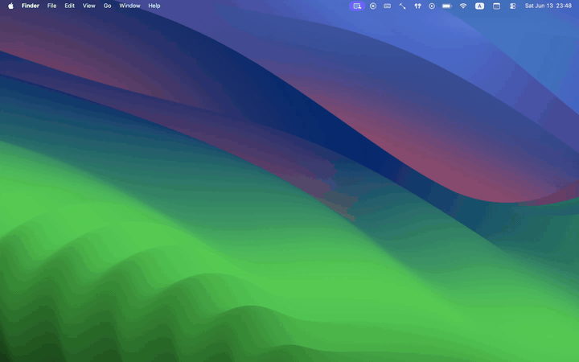

# CleanLock

**Clean your MacBook without accidental key presses.**

CleanLock is a small native macOS menu bar utility that temporarily blocks keyboard input and trackpad clicks while you clean your MacBook.

It dims the screen, blocks accidental input, and lets you exit cleaning mode by holding the left and right Command keys for 3 seconds.

---

## Language

🇺🇸 [English](#-english)
🇷🇺 [Русский](#-русский)

---

# 🇺🇸 English

## Features

* Blocks keyboard input while cleaning.
* Blocks trackpad and mouse clicks, taps, and drag events.
* Keeps cursor movement and scrolling available.
* Shows a dark full-screen overlay so dust, fingerprints, and smudges are easier to see.
* Unlocks with `Left Command` + `Right Command` held for 3 seconds.
* Shows visual Command-key indicators and unlock progress.
* Includes an automatic safety timeout: 5, 10, or 20 minutes.
* Can dim all displays or only the main display.
* Runs as a native macOS menu bar app.
* Works locally on your Mac.
* No network access, no analytics, no tracking, no key logging.

## Demo

> Demo video/GIF will be added soon.

<!--
<p align="center">
  
</p>
-->

## Why

Cleaning a MacBook keyboard or trackpad usually means either shutting the Mac down or fighting accidental key presses, clicks, app switches, and random shortcuts.

CleanLock gives you a quick temporary cleaning mode:

1. Turn it on from the menu bar.
2. Clean your keyboard, trackpad, or screen.
3. Hold both Command keys to unlock.

That is the whole idea. No extra modes, no clutter, no background nonsense.

## How It Works

CleanLock uses macOS event taps to temporarily intercept keyboard and pointer events while cleaning mode is active.

During cleaning mode:

* keyboard input is blocked;
* clicks, taps, and drag events are blocked;
* cursor movement remains available;
* scrolling remains available;
* the screen is dimmed with a dark overlay;
* unlock is triggered by holding both Command keys for 3 seconds.

If the unlock gesture does not work, CleanLock exits automatically after the configured safety timeout.

## Privacy

CleanLock is built to stay local and quiet.

* CleanLock does not record keystrokes.
* CleanLock does not store input.
* CleanLock does not send data anywhere.
* CleanLock does not use the internet.
* CleanLock does not use analytics.
* CleanLock does not track users.
* CleanLock only listens for input while cleaning mode is active.

The app needs input-related permissions only to block input during cleaning mode and detect the unlock gesture.

## Required Permissions

macOS requires explicit permission for apps that monitor or intercept input.

CleanLock asks for:

### Accessibility

Used to temporarily block keyboard and pointer events during cleaning mode.

### Input Monitoring

Used to detect the left and right Command keys for unlocking.

You can review or revoke these permissions anytime in:

```text
System Settings -> Privacy & Security -> Accessibility
System Settings -> Privacy & Security -> Input Monitoring
```

## How To Use

1. Launch CleanLock.
2. Complete onboarding.
3. Grant the required macOS permissions.
4. Pass the unlock test by holding left and right Command.
5. Click the CleanLock icon in the menu bar.
6. Choose `Start Cleaning Mode`.
7. Clean your keyboard, trackpad, or screen.
8. Hold left and right Command for 3 seconds to exit cleaning mode.

If the unlock gesture does not work, CleanLock exits automatically after the configured safety timeout.

## External Keyboards

CleanLock uses the left and right Command keys as the unlock gesture.

Some external keyboards do not have a right Command key or report modifier keys differently. If the gesture is unavailable, the safety timeout will still return control automatically.

## Limitations

* Some macOS system-level gestures may still work.
* The power button is not blocked.
* CleanLock is intended as a convenience utility, not a security lock.
* On external keyboards without a right Command key, manual unlock may be unavailable, so auto-unlock is always enabled.

## Requirements

* macOS 13.0 or later
* Xcode 15 or later recommended

## Build From Source

Clone the repository and open the Xcode project:

```bash
git clone https://github.com/fromtimo/CleanLock.git
cd CleanLock
open CleanLock.xcodeproj
```

Then select the `CleanLock` scheme and run the app from Xcode.

The first launch will show onboarding and guide you through the required macOS permissions.

## Tech Stack

* Swift
* SwiftUI
* AppKit
* CGEventTap
* ServiceManagement
* UserDefaults

## Project Status

CleanLock is a focused macOS utility. It is usable, intentionally small, and built around one job: making it less annoying to clean a MacBook without triggering random input.

Issues and pull requests are welcome.

## License

CleanLock is released under the MIT License. See [LICENSE](LICENSE).

---

# 🇷🇺 Русский

## Что такое CleanLock

**CleanLock** - маленькая нативная macOS-утилита для меню-бара, которая помогает спокойно почистить клавиатуру и трекпад MacBook без случайных нажатий.

Приложение временно блокирует клавиатуру, клики и тапы по трекпаду, затемняет экран и выходит из режима очистки по удержанию левой и правой Command в течение 3 секунд.

## Возможности

* Блокирует ввод с клавиатуры во время очистки.
* Блокирует клики, тапы и drag-события мыши/трекпада.
* Оставляет движение курсора и скролл доступными.
* Показывает тёмный полноэкранный overlay, чтобы пыль, отпечатки и разводы были заметнее.
* Выходит из режима по удержанию `Left Command` + `Right Command` в течение 3 секунд.
* Показывает визуальные индикаторы Command-клавиш и прогресс выхода.
* Имеет страховочный таймер автоотключения: 5, 10 или 20 минут.
* Может затемнять все экраны или только главный экран.
* Работает как нативное macOS-приложение в меню-баре.
* Работает локально на Mac.
* Без интернета, аналитики, трекинга и записи нажатий.

## Демо

> Видео/GIF-демо будет добавлено позже.

<!--
<p align="center">
  
</p>
-->

## Зачем это нужно

Когда нужно протереть клавиатуру или трекпад MacBook, обычно приходится либо выключать Mac, либо терпеть случайные нажатия, клики, переключения приложений и странные системные шорткаты.

CleanLock даёт простой режим очистки:

1. Включаешь режим через иконку в меню-баре.
2. Чистишь клавиатуру, трекпад или экран.
3. Удерживаешь две Command, чтобы выйти.

Всё. Без лишних режимов, настроек и цифрового цирка.

## Как это работает

CleanLock использует macOS event taps, чтобы временно перехватывать события клавиатуры и указателя, пока активен режим очистки.

Во время режима очистки:

* клавиатура заблокирована;
* клики, тапы и drag-события заблокированы;
* движение курсора остаётся доступным;
* скролл остаётся доступным;
* экран затемняется тёмным overlay;
* выход происходит по удержанию двух Command в течение 3 секунд.

Если сочетание для выхода не сработает, CleanLock автоматически выключит режим очистки по страховочному таймеру.

## Приватность

CleanLock работает локально и не собирает данные.

* CleanLock не записывает нажатия клавиш.
* CleanLock не сохраняет ввод.
* CleanLock не отправляет данные куда-либо.
* CleanLock не использует интернет.
* CleanLock не использует аналитику.
* CleanLock не отслеживает пользователей.
* CleanLock слушает ввод только во время активного режима очистки.

Разрешения нужны только для временной блокировки ввода и определения сочетания клавиш для выхода.

## Необходимые разрешения

macOS требует явного разрешения для приложений, которые отслеживают или перехватывают ввод.

CleanLock запрашивает:

### Универсальный доступ

Нужен для временной блокировки клавиатуры и событий указателя во время режима очистки.

### Мониторинг ввода

Нужен для определения левой и правой Command при выходе из режима очистки.

Проверить или отозвать разрешения можно в:

```text
Системные настройки -> Конфиденциальность и безопасность -> Универсальный доступ
Системные настройки -> Конфиденциальность и безопасность -> Мониторинг ввода
```

## Как использовать

1. Запусти CleanLock.
2. Пройди onboarding.
3. Выдай необходимые разрешения macOS.
4. Пройди проверку выхода, удержав левую и правую Command.
5. Нажми на иконку CleanLock в меню-баре.
6. Выбери `Включить режим очистки`.
7. Почисти клавиатуру, трекпад или экран.
8. Удерживай левую и правую Command 3 секунды, чтобы выйти из режима очистки.

Если сочетание для выхода не сработает, CleanLock автоматически выйдет из режима по страховочному таймеру.

## Внешние клавиатуры

CleanLock использует левую и правую Command как сочетание для выхода.

На некоторых внешних клавиатурах может не быть правой Command, либо клавиатура может иначе передавать modifier-клавиши. Если ручной выход недоступен, страховочный таймер автоматически вернёт управление.

## Ограничения

* Некоторые системные жесты macOS могут продолжать работать.
* Кнопка питания не блокируется.
* CleanLock - это удобная утилита для очистки, а не защитная блокировка.
* На внешних клавиатурах без правой Command ручной выход может быть недоступен, поэтому автоотключение всегда включено.

## Требования

* macOS 13.0 или новее
* Рекомендуется Xcode 15 или новее

## Сборка из исходников

Клонируй репозиторий и открой Xcode-проект:

```bash
git clone https://github.com/fromtimo/CleanLock.git
cd CleanLock
open CleanLock.xcodeproj
```

Затем выбери схему `CleanLock` и запусти приложение из Xcode.

При первом запуске CleanLock покажет onboarding и проведёт через необходимые разрешения macOS.

## Технологии

* Swift
* SwiftUI
* AppKit
* CGEventTap
* ServiceManagement
* UserDefaults

## Статус проекта

CleanLock - сфокусированная macOS-утилита. Она намеренно маленькая и делает одну задачу: помогает спокойно почистить MacBook без случайного ввода.

Issues и pull requests приветствуются.

## Лицензия

CleanLock распространяется под лицензией MIT. См. [LICENSE](LICENSE).
